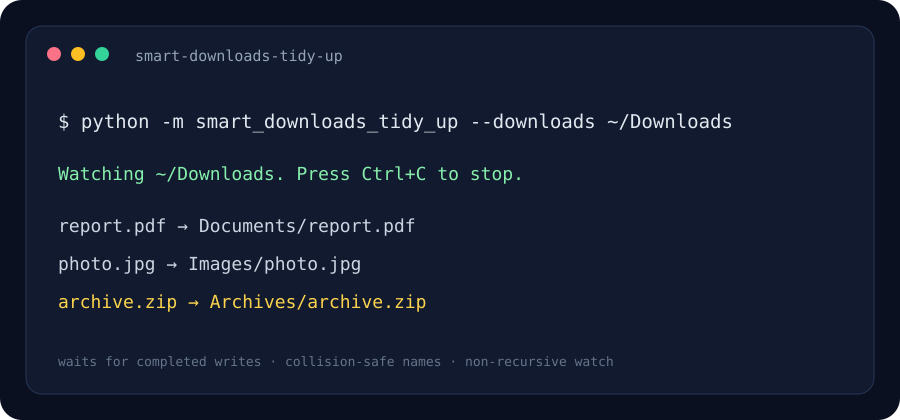

# Smart Downloads Tidy-Up

A lightweight background organizer that watches one downloads directory and moves completed files into type-based folders.

> The image above is an illustrative terminal preview.

## Problem it solves

Downloads quickly turn into a mixed pile of documents, media, archives, and source files. This watcher classifies files by extension and moves them only after their size has stopped changing, reducing the chance of moving a partial download.

## Quick start

Requires Python 3.10 or later.

~~~powershell
python -m venv .venv
.venv\Scripts\Activate.ps1
python -m pip install -r requirements.txt
python -m smart_downloads_tidy_up --downloads "$HOME/Downloads"
~~~

Run once against files already in the folder:

~~~powershell
python -m smart_downloads_tidy_up --downloads "$HOME/Downloads" --once
~~~

Press Ctrl+C to stop watch mode. The default watch is non-recursive; files are moved into Documents, Images, Video, Audio, Archives, Code, or Other.

## How it works

1. Watchdog listens for new or renamed files directly inside the selected directory.
2. A worker waits for file size to remain unchanged across several checks.
3. The extension map chooses a destination category.
4. If a filename already exists, a numbered suffix is chosen rather than overwriting it.
5. Activity and failures are written to downloads-tidy-up.log.

## Project layout

- **smart_downloads_tidy_up/organizer.py** — extension map, stability check, and safe move.
- **smart_downloads_tidy_up/cli.py** — one-shot and watch modes.
- **assets/preview.svg** — illustrative terminal preview.

## Tech stack

Python · watchdog · pathlib · shutil · threading · logging

## Safety notes

The organizer changes file locations. Try it first with a disposable sample directory. Unknown extensions go to Other. Files with common in-progress suffixes are ignored. It does not inspect file contents or recurse into categorized folders.

## License

MIT.
